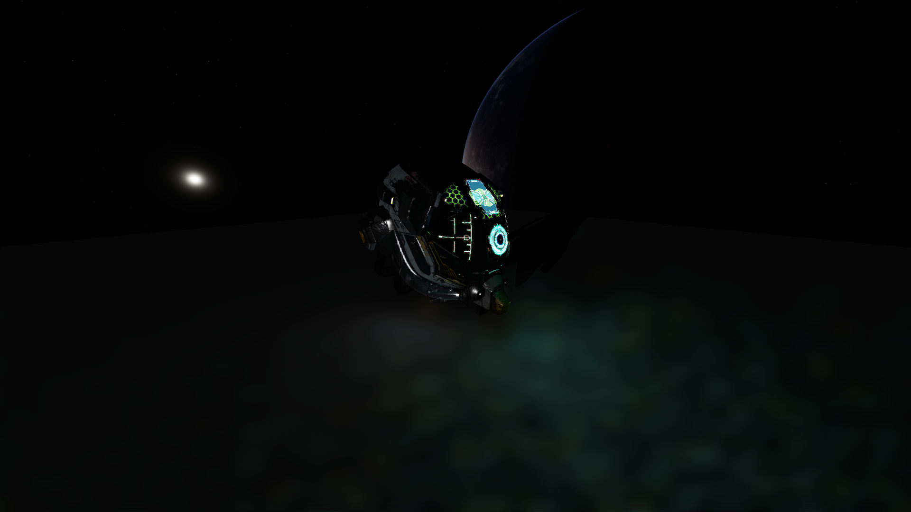
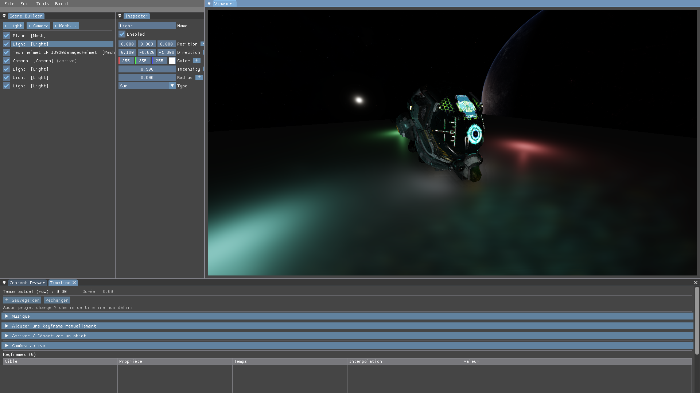
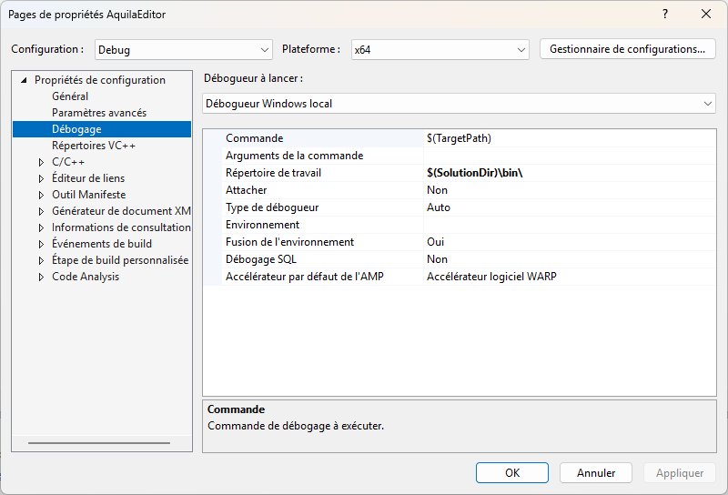

# Aquila Engine


**Aquila Engine** is an experimental rendering engine developed with **C++23** and **Vulkan 1.4+**.

This is primarily a **learning project**, developed over approximately **one year**, with the goal of exploring modern rendering techniques, Vulkan, and the architecture of a real-time rendering engine.

> **Status:** Work in Progress

---

## Rendering

Aquila Engine uses a **RenderGraph** to organize rendering passes and their dependencies.

### Render Showcase

| GI                                                    | GI + Editor                                                 |
| ----------------------------------------------------- | ----------------------------------------------------------- |
|  |  |


### Render Passes

* **Global Illumination (GI)**
* **FXAA** — Fast Approximate Anti-Aliasing
* **ATWF** — Adaptive Temporal Wavelet Filter

---

## Features

### Rendering

* Vulkan 1.4+
* Rendering abstraction layer
* RenderGraph
* Global Illumination pass
* FXAA pass
* ATWF pass

### Asset Loading

* GLB loader
* Sound loading

### Tools

* CPU profiler
* ImGui-based editor
* Timeline system

---

## Architecture

Aquila Engine is built around a rendering abstraction layer and a **RenderGraph**.
The goal of this architecture is to make rendering passes and their dependencies easier to manage while keeping the renderer modular and extensible.

---

## Installation

### Requirements

Before building Aquila Engine, make sure you have:

* **Vulkan 1.4+**
* A compiler supporting **C++23**
* The required Vulkan dependencies and drivers

### Clone the Repository

```bash
git clone <https://github.com/Angar0Os/Aquila>
```

### Configure the `bin` Folder

Make sure the `bin` folder is correctly configured according to the project structure.



### Set AquilaEditor as the Startup Project

If you are using Visual Studio, set:

```text
AquilaEditor
```

as the **Startup Project**.

You can then build and run the editor.

---

## Roadmap

The following features are planned:

* [ ] Rework ImGui visuals
* [ ] Rework timeline features
* [ ] Temporal GI
* [ ] GI denoiser
* [ ] OBJ loader
* [ ] Environment map loader
* [ ] 2D renderer

  * [ ] Text rendering
  * [ ] Image rendering

---

## Technologies

| Technology      | Usage                     |
| --------------- | ------------------------- |
| **C++23**       | Main programming language |
| **Vulkan 1.4+** | Graphics API              |
| **ImGui**       | Editor interface          |
| **GLB**         | 3D model loading          |

---

## Learning Project

Aquila Engine is primarily a **learning project**.

The development of the engine focuses on experimenting with:

* Modern rendering architecture
* Vulkan and explicit GPU resource management
* RenderGraph design
* Global Illumination techniques
* Post-processing passes
* Asset loading
* CPU profiling
* Editor development

The project is continuously evolving as new techniques are explored and implemented.

---

## Issues

If you encounter a problem, feel free to open an **Issue** on the repository.

When reporting an issue, please provide as much relevant information as possible:

* Operating system
* GPU
* Vulkan driver version
* Steps to reproduce the issue
* Relevant logs or screenshots

Feedback and suggestions are also welcome.

---

## License

This project is under MIT License.